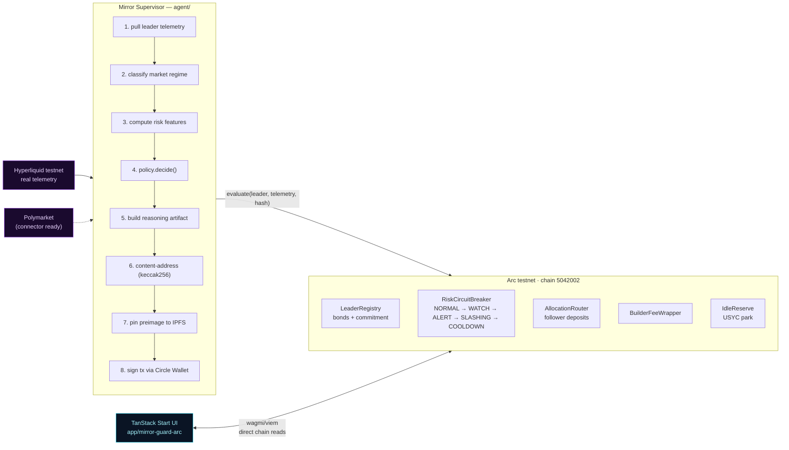
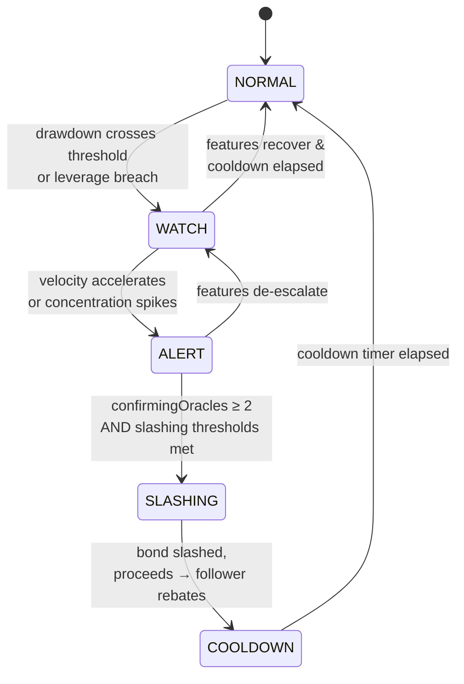

<p align="center">
  <a href="https://mirror.ibxlab.com/">
    
  </a>
</p>

<p align="center">
  <a href="https://mirror.ibxlab.com/"></a>
  <a href="https://youtu.be/N-ePTDC62Z0"></a>
  <a href="https://github.com/aliveevie/mirror"></a>
  <a href="https://hub.docker.com/r/aliveevie/mirror"></a>
</p>

<p align="center">
  
  
  
  
  
  
  
  
</p>

<p align="center"><sub><b>Mirror</b> is a protocol for copy-trading where the leader, not the follower, has skin in the game. Leaders post a USDC performance bond on <a href="https://www.arc.network">Arc</a>; an autonomous supervisor reads the leader's live trading telemetry and can slash that bond when risk breaches commitment — settled in under a second, signed by a Circle Developer-Controlled Wallet, with every decision audited on-chain.</sub></p>

<p align="center"></p>

## Why it exists

Modern social and copy-trading platforms have an inverted incentive structure:

- The **leader** publishes a track record and collects subscription / fee revenue regardless of outcome.
- The **follower** mirrors at their own capital risk.
- When the leader actually blows up — overlevered, concentrated, drifting from their declared strategy — the follower bears 100% of the loss. The leader keeps the fees they already collected.

Disclosure (track records, drawdown charts) does not fix this. Only **consequence** does. Mirror gives the consequence a home: an upfront USDC bond, posted by the leader, that an autonomous supervisor can slash without a human in the loop.

<p align="center"></p>

## How it works



The flow:

1. The **agent** runs a 15-second loop. Every tick it pulls live telemetry from the leader's trading venue.
2. It computes a six-dimensional feature vector + a regime classification.
3. A deterministic policy returns a decision (`NORMAL`, `WATCH`, `ALERT`, `SLASHING`, `ROTATE_TO_USYC`).
4. The agent builds a JSON **reasoning artifact** with all inputs and the policy output, computes its `keccak256` hash, pins the preimage to IPFS, and submits `evaluate(leader, telemetry, artifactHash)` to the on-chain circuit breaker.
5. The breaker's hysteresis FSM updates state; if the leader reaches `SLASHING` with a multi-oracle quorum, the bond is slashed and proceeds settle to follower rebates.

There is no human in the loop. The agent decides when to evaluate, what features matter for the current regime, which decision the policy returns, and signs the transaction itself.

<p align="center"></p>

## Live deployment

### Contracts · Arc testnet (chain `5042002`)

| Contract | Address | Explorer |
|---|---|---|
| **LeaderRegistry** | `0xf1559Cea926906329a063a071c5290C4a65A2806` | [view](https://explorer.testnet.arc.network/address/0xf1559Cea926906329a063a071c5290C4a65A2806) |
| **RiskCircuitBreaker** | `0x4C329C3d68ef2c9510E249A8FF991EfbDf15F1b9` | [view](https://explorer.testnet.arc.network/address/0x4C329C3d68ef2c9510E249A8FF991EfbDf15F1b9) |
| **AllocationRouter** | `0x95Aa364114033d1a72F15361321295c54cBacA10` | [view](https://explorer.testnet.arc.network/address/0x95Aa364114033d1a72F15361321295c54cBacA10) |
| **BuilderFeeWrapper** | `0xb3dD9713A8353eDA05F967a5154B8fCE6E5604C8` | [view](https://explorer.testnet.arc.network/address/0xb3dD9713A8353eDA05F967a5154B8fCE6E5604C8) |
| **IdleReserve** | `0x41fBF4092Fee25632F368c35Bb88692568090490` | [view](https://explorer.testnet.arc.network/address/0x41fBF4092Fee25632F368c35Bb88692568090490) |
| **USDC** *(Arc native, gas)* | `0x3600000000000000000000000000000000000000` | [view](https://explorer.testnet.arc.network/address/0x3600000000000000000000000000000000000000) |
| **USYC** *(idle reserve)* | `0xe9185F0c5F296Ed1797AaE4238D26CCaBEadb86C` | [view](https://explorer.testnet.arc.network/address/0xe9185F0c5F296Ed1797AaE4238D26CCaBEadb86C) |

> Every contract is **initialized once and locked**. No proxy admin, no upgrade hatch, no owner-controlled emergency switch. The protocol's rules cannot be changed after the bond is posted.

### Agent wallet

The supervisor signs every transaction through a Circle Developer-Controlled Wallet — the entity secret is encrypted RSA-OAEP-SHA256 per request, the key never leaves Circle's HSM.

| | |
|---|---|
| **Address** | `0xce61a403fc0155170258225669a78c86f7b2887c` |
| **Explorer** | [view all 1,480+ supervisor txs](https://explorer.testnet.arc.network/address/0xce61a403fc0155170258225669a78c86f7b2887c) |
| **Cadence** | 15 s tick — autonomous, 24 / 7 |

### Representative transactions

| Event | Block | Tx |
|---|---|---|
| `evaluate(...)` from agent → RiskCircuitBreaker | `43352298` | [`0x5557830f…99108c76`](https://explorer.testnet.arc.network/tx/0x5557830fdc32819dccf3d75141a237c93c97f07aaa7e8df933f49c92eb61ec76) |
| FSM transition · `NORMAL → WATCH` | `43184616` | [`0xcd86df8d…81b64e`](https://explorer.testnet.arc.network/tx/0xcd86df8d676aff16849d1c0e7bdadfe793c52c3c08763c40e201e8a75181b64e) |
| FSM transition · `WATCH → NORMAL` | `43189635` | [`0xacf2f0ff…f317a11d86`](https://explorer.testnet.arc.network/tx/0xacf2f0ff9200b05d1bfa7cfb647151e5bd3cebbf85974d462d96d9c317a11d86) |
| Leader bond · 5 USDC (deployer) | `43170502` | [`0x98d3573c…7328b2dc`](https://explorer.testnet.arc.network/tx/0x98d3573cea03e9129ca5b8bc50aa34c5a1df788a66dce05d8c0a986f7328b2dc) |
| Leader bond · 1 USDC (HL wallet) | `43172121` | [`0x83b92ca3…598a61c1c3f`](https://explorer.testnet.arc.network/tx/0x83b92ca36b969201f204842a38dbdf04a0f26f6d7038894371d66598a61c1c3f) |

<p align="center"></p>

## The supervisor

### Feature vector

The per-tick policy uses six dimensions, all derived from venue telemetry, all bps-normalized where applicable:

| Feature | Measures | Why it matters |
|---|---|---|
| `drawdown_realized_bps` | Peak-to-trough equity decline since the bond opened | First-order solvency signal |
| `drawdown_velocity_bps_per_hour` | Rate of new drawdown over the last hour | The *blowing up* signal — clamped to ≥0 to avoid sign noise during recoveries |
| `position_concentration_hhi` | Herfindahl of notional across symbols (0–10000) | Detects single-name blowups masked by total-equity stability |
| `correlation_drift` | Stddev of equity log-returns over the history window | Quantifies how erratically the leader is moving relative to baseline |
| `leverage_current` | Live leverage actually being run | Compared against the declared maximum |
| `leverage_declared_max` | The leverage the leader committed to at bond time | The other half of the leverage-breach signal |

### State machine



### Multi-oracle slashing

`ALERT → SLASHING` requires `confirmingOracles ≥ 2` enforced **inside the contract**, not the agent. A single venue lie cannot trip a slash. Today the supervisor reads Hyperliquid; the `VenueConnector` interface is a 30-line file per integration — Polymarket, dYdX, GMX, and Vertex are scaffolded behind the same shape.

<p align="center"></p>

## Reasoning is auditable forever

Every supervisor decision builds a content-addressed reasoning artifact:

```jsonc
{
  "agentVersion": "mirror-supervisor/0.1.0",
  "leader":       "0xACE91A3F253FdDba383E65a2bAd50ebB1A92E5b3",
  "regime":       { "label": "calm", "realizedVolBps": 84, "fundingDispersionBps": 3, "correlationStress": 0 },
  "features":     { "drawdown_realized_bps": 1240, "drawdown_velocity_bps_per_hour": 612, "position_concentration_hhi": 8800, "correlation_drift": 220, "leverage_current": 11, "leverage_declared_max": 5 },
  "thresholds":   { "WATCH.drawdown_bps": 1000, "ALERT.drawdown_bps": 2000, "SLASHING.drawdown_bps": 3500, "leverage_breach_bps": 2000 },
  "decision":     "WATCH",
  "parameters":   { "bps": 0 },
  "confidence":   0.93
}
```

The agent computes `keccak256` of this object, pins the preimage to IPFS, and commits the hash in the same transaction that updates the FSM. Two consequences:

- Anyone — leaders, followers, regulators — can reconstruct *why* the bond moved between states.
- The agent cannot rewrite history. A divergence between what's pinned and what's on-chain is a falsifiable indictment of the operator.

<p align="center"></p>

## Stack

| Plane | Tech |
|---|---|
| **Settlement** | Arc testnet · USDC-as-gas · sub-second finality |
| **Programmable money** | USDC (bonds + capital), USYC (idle yield), Circle Developer-Controlled Wallets (agent signing), Circle CCTP-ready (cross-chain follower onboarding) |
| **Trading venue** | Hyperliquid testnet — perp + spot connector, EIP-712 user-signed actions |
| **Contracts** | Solidity 0.8.x, init-once-locked, no upgrade proxy |
| **Agent** | TypeScript on Bun · multi-oracle ready · try / catch at every layer so transient HL / RPC / Circle timeouts cannot kill the process |
| **UI** | TanStack Start · React 19 · wagmi v2 · viem v2 · Tailwind v4 · shadcn / Radix · served by `workerd` |
| **Distribution** | Single `linux/amd64` Docker image: agent + UI side by side |

<p align="center"></p>

## Quick start

```sh
docker pull aliveevie/mirror:latest
docker run --rm -p 8080:8080 --env-file .env aliveevie/mirror:latest
# UI:    http://localhost:8080
# Agent: docker logs <container>
```

The container starts the supervisor and the UI side by side via a small entrypoint; if either process dies the container exits and the restart policy recovers the pair. Detailed build instructions in [`DOCKER.md`](./DOCKER.md).

To run from source:

```sh
git clone https://github.com/aliveevie/mirror.git
cd mirror
bun install                              # workspaces: agent, app, packages/shared
bun run agent/src/index.ts &             # supervisor
cd app/mirror-guard-arc && bun run dev   # UI on http://localhost:5173
```

<p align="center"></p>

## Repo layout

```
mirror/
├─ contracts/            Solidity sources (init-once-locked, no proxy admin)
├─ agent/                supervisor loop, venue connectors, policy, artifact builder
│  └─ src/
│     ├─ loop.ts             tick scheduler with per-leader try/catch
│     ├─ features.ts         the six-dimensional feature vector
│     ├─ policy.ts           regime-aware threshold table → decision
│     ├─ regime.ts           market-regime classifier
│     ├─ artifact.ts         reasoning artifact + content addressing
│     ├─ wallet.ts           Circle Developer-Controlled Wallet signer
│     ├─ venues/             venue connector interface + Hyperliquid impl
│     └─ market/             market-snapshot inputs (HL macro)
├─ app/mirror-guard-arc/ TanStack Start UI (the live frontend)
│  └─ src/
│     ├─ routes/             index / leader / follower / agent
│     ├─ hooks/              use-supervisor-feed · use-leaders · use-hl-telemetry
│     ├─ abi/                typed ABIs for every deployed contract
│     ├─ components/web3/    chain-aware presentation primitives
│     └─ components/ui/      shadcn / Radix design system
├─ packages/shared/      ABIs · addresses · reasoning artifact schema (zod) · keccak helper
├─ Dockerfile           single-image multi-stage build
├─ docker-entrypoint.sh launches agent + UI side by side
└─ docker-compose.yml   single mirror service, env_file=.env, port 8080
```

<p align="center"></p>

## Roadmap

- More venues. The `VenueConnector` interface is venue-agnostic. Polymarket, dYdX, GMX, Vertex are next.
- Cross-chain follower onboarding. Deposit USDC on any CCTP-supported chain, route to Arc.
- Leader leaderboard. Bond size · realized PnL · risk-adjusted return · time-in-WATCH ratio.
- Follower risk profiles. Time-weighted DCA, laddered exposure, hedged baskets.
- A formal slashing-economics paper covering bond sizing, oracle collusion bounds, and recovery curves.

<p align="center"></p>

## Links

<table align="center">
  <tr>
    <td align="center">
      <a href="https://mirror.ibxlab.com/">
        
      </a>
    </td>
    <td align="center">
      <a href="https://youtu.be/N-ePTDC62Z0">
        
      </a>
    </td>
    <td align="center">
      <a href="https://github.com/aliveevie/mirror">
        
      </a>
    </td>
    <td align="center">
      <a href="https://hub.docker.com/r/aliveevie/mirror">
        
      </a>
    </td>
  </tr>
</table>

<p align="center"><sub>© 2026 · Mirror Protocol · MIT-licensed</sub></p>
